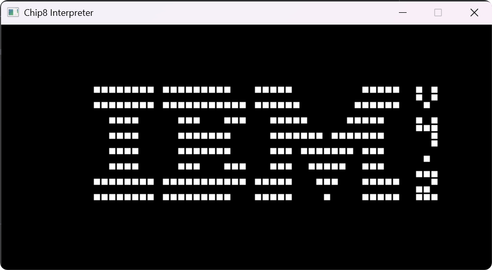

# chip8-cpp

A CHIP-8 interpreter written in C++ with SDL2. The beginning of my game emulator development journey.

<p align="center"></p>

## Features

- Emulates the CHIP-8 instruction set
- Supports CHIP-8 ROMs
- SDL2 for graphics, input handling and sound
- Simple and clean code structure
- Cross-platform compatibility

## Requirements

- C++23 or later
- CMake
- GCC / Clang / MSVC / MinGW

## Build Instructions

1. Clone the repository:
   ```bash
   git clone https://github.com/zzxzzk115/chip8-cpp.git
    cd chip8-cpp
    ```

2. Create a build directory:
   ```bash
   mkdir build
   cd build
   ```
3. Configure the project with CMake:
   ```bash
    cmake ..
    ```
4. Build the project:
   ```bash
   cmake --build .
   ```
5. Run the emulator:
   ```bash
    ./chip8-cpp path/to/your/rom.ch8
    ```

## License

This project is licensed under the MIT License. See the [LICENSE](LICENSE) file for details.